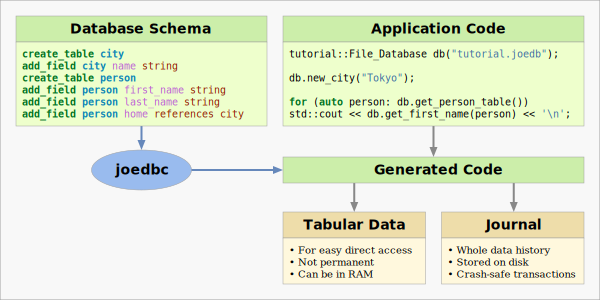

# Joedb, the Journal-Only Embedded Database

SQL Databases are the standard tool for manipulating relational data with
[ACID](https://en.wikipedia.org/wiki/ACID) transactions, but they are not
convenient to use from C++. Raw SQL APIs such as
[SQLite](https://www.sqlite.org/cintro.html) do not match the C++ programming
paradigm well: queries are strings parsed at run time, and the API is not
type-safe. An
[ORM](https://en.wikipedia.org/wiki/Object%E2%80%93relational_mapping) or a
template library such as [sqlpp11](https://github.com/rbock/sqlpp11) can hide
SQL from the C++ code, and improve type safety, but it adds to complexity.

In many applications, the immense complexity of a SQL database is not at all
necessary. Joedb is a minimalist low-level alternative that can perform ACID
transactions, on a local database or over a network connection. As shown in the
diagram below, joedb compiles the database schema into C++ code. Applications
using this code can then manipulate data like a C++ container, with
compile-time checking of field names and types:

Other systems such as [protocol buffers](https://protobuf.dev/) provide similar
type-safe mechanisms for serializing structured data, but are missing key
properties of a database, such as concurrency, transactions, and incremental
crash-safe updates. Joedb can offer all these features by storing data as a
journal of transactions. The whole data history is stored, so it is possible to
re-create any past state of the database. Joedb also has a network protocol,
and can operate a bit like [git for structured
data](https://www.remi-coulom.fr/joedb/concurrency.html).

To give an indication of joedb's simplicity, the table below shows the size
of joedb's source code compared to some other libraries. Lines of code are
counted with ``wc -l``. Compressed size is the size in bytes after removing
comments and compressing with gzip. These numbers were measured on 2024-07-28
on the main branch.

| Software       | Lines of code | Compressed size | Notes
|:---------------|--------------:|----------------:|:--------------------------------
| joedb          |        19,288 |          72,268 | without tests
| nlhohmann/json |        24,941 |          87,168 | single include
| boost/json     |        37,609 |         123,229 |
| SQLite         |       258,281 |       1,067,983 | sqlite3.c amalgamation
| PostgreSQL     |     1,513,329 |       5,250,316 | content of src dir, without tests

So joedb is an extremely simple low-level foundation for sharing relational
data. It would be possible to build a SQL database on top of it, but it is
already very convenient by itself.

For more information, please take at a look at the
[documentation](https://www.remi-coulom.fr/joedb/intro.html).
