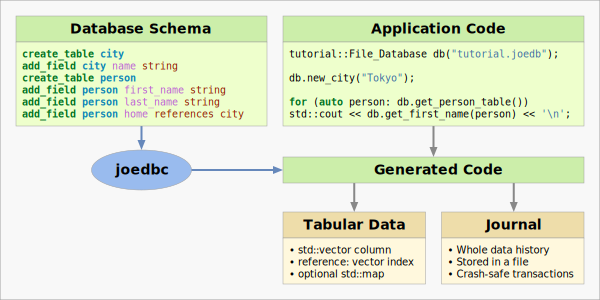

# Joedb, the Journal-Only Embedded Database

The usual approach to [ACID](https://en.wikipedia.org/wiki/ACID) manipulation
of structured data is SQL, but it is complicated to use in C++. Raw SQL APIs
such as [SQLite](https://www.sqlite.org/cintro.html) do not match the C++
programming paradigm well: queries are strings parsed at run time, and the API
is not type-safe. An
[ORM](https://en.wikipedia.org/wiki/Object%E2%80%93relational_mapping) or Query
Object Model can hide SQL from the C++ code, and improve type safety, but it
can result in sub-optimal performance, and adds to complexity.

Joedb aims to offer a minimalist alternative to using SQL from C++, by
providing a direct low-level access to data. As shown in the diagram below,
joedb compiles the database schema into C++ code. Applications using this code
can then access a file like a C++ container.

Other systems such as [protocol buffers](https://protobuf.dev/) provide similar
type-safe mechanisms for serializing structured data, but are missing key
properties of a relational database, such as concurrency, transactions, and
incremental crash-safe updates. Joedb can offer all these features by storing
data as a journal of transactions. The whole data history is stored, so it is
possible to re-create any past state of the database. Joedb also has a network
protocol, and can operate in a distributed fashion, a bit like [git for
structured data](https://www.remi-coulom.fr/joedb/concurrency.html).

For more information, please take at a look at the
[documentation](https://www.remi-coulom.fr/joedb/intro.html).
